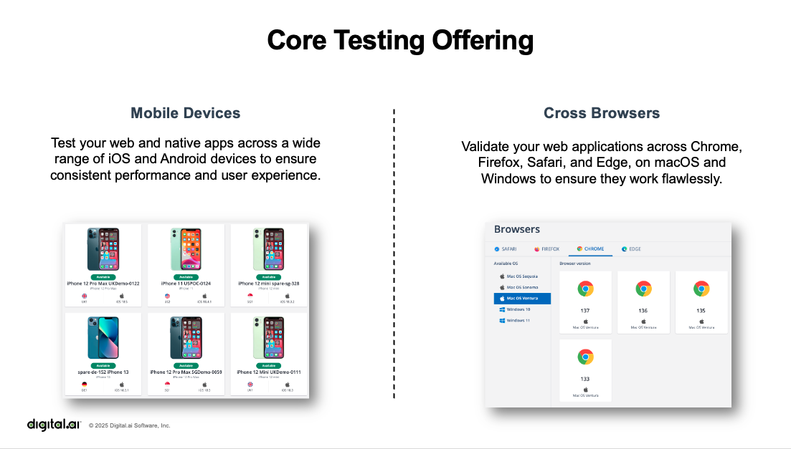
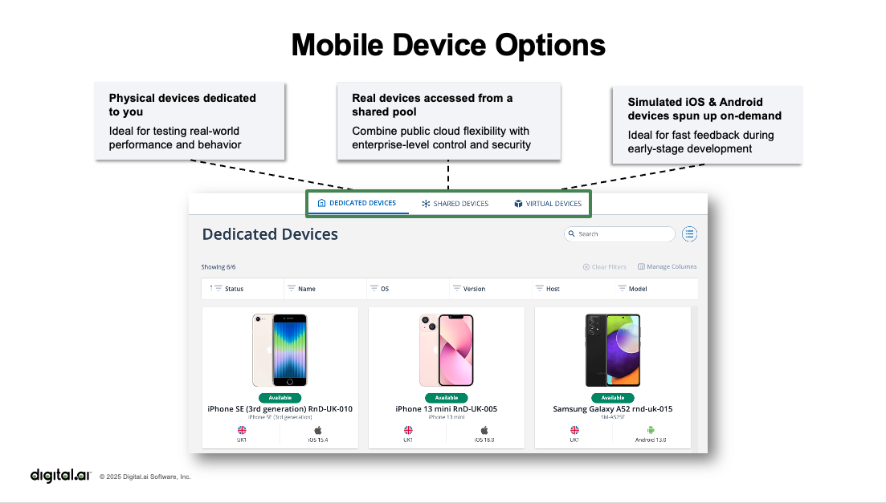
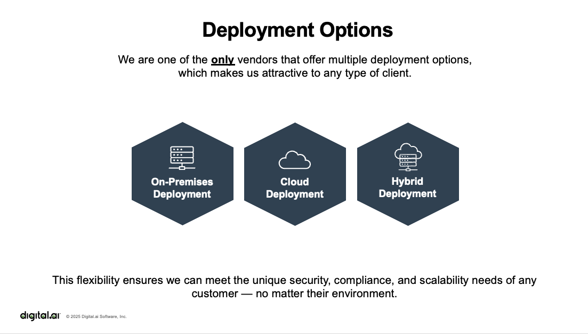

# Getting Started with Digital Testing

## Introduction to Digital.ai Testing Test Lab

Where, and against what, are you running your mobile and web application tests?

How much time, effort and thought cycles are you spending to:

- **Ensure your team has access to devices** your customers are using?
- **Run your tests against the exploding matrix** of device model / OS / version combinations?
- **Measure -- let alone *analyze* --** how your application performs and affects your customer's device under various network conditions?
- **Verify that your application is accessible** for those who depend on your services?

Digital.ai Testing provides a secure and flexible test lab where you can run your tests against the devices, under conditions that give you full visibility into the total perceived quality of your application.

### Core Testing Offering

Digital.ai Testing offers comprehensive testing capabilities across both mobile devices and cross-browser testing:



**Mobile Devices**: Test your web and native apps across a wide range of iOS and Android devices to ensure consistent performance and user experience.

**Cross Browsers**: Validate your web applications across Chrome, Firefox, Safari and Edge, on macOS and Windows to ensure they work flawlessly.

### Device Options

Choose the device option that best fits your testing needs:

- **Dedicated Devices**: Real iOS and Android devices dedicated to your private environment -- ideal for testing real-world performance and behavior
- **Shared Devices**: Real iOS and Android devices accessed from a shared pool -- public cloud flexibility with advanced control and enterprise grade security
- **Simulated devices**: iOS simulators & Android emulators -- suitable for fast feedback during early-stage development




### Deployment Options

Choose the deployment option that provides the level of control, isolation and privacy that you require:

- **Private Cloud**: Dedicated environment fully managed by Digital.ai
- **On-Prem**: Fully capable environment deployed in your datacenter
- **Hybrid**: Best of both worlds, unified access for your team



Digital.ai Testing can meet your security, compliance and scalability needs — whatever your deployment preference.

### Key Benefits

- Real mobile devices, hardware and network configuration
- Test function, performance and accessibility to fully assess the user experience
- Centralized view of quality posture, trends, failure hotspots and actionable insights
- Manage devices and browsers from a centralized hub
- S2S connectivity and added security by integrating with your LDAP or SSO
- 24/7 Enterprise Support with Dedicated Engineers and real-time monitoring
- Our datacenters are ISO 27001 and SOC-2 secured

## Getting Started with Containerized Testing

This tutorial will guide you through running automated tests using the **Containerized Testing** option, which is the recommended approach for getting started quickly with minimal setup overhead.

### Prerequisites

Before you begin, ensure you have:

- **Docker**: Docker Engine 20.10+
- **Docker Compose**: 2.0+ (optional but recommended)
- **Digital.ai Testing Cloud**: Access credentials and the URL for your Digital.ai Testing lab endpoint

### Repository

We'll be using the example code from this GitHub repository:
[https://github.com/ddreakford/CommunityCode-AppiumCodeExamples.git](https://github.com/ddreakford/CommunityCode-AppiumCodeExamples.git)

This repository demonstrates how to run Appium-based tests on devices hosted by Digital.ai Testing Cloud, with samples for Java/TestNG and Python/pytest implementations. The containerized option bundles the required dependencies in a Docker image to reduce time and effort associated with dependency management while affording full flexibility to modify test code.

For complete documentation on the containerized testing approach, see the [Containerized Testing Guide](https://github.com/ddreakford/CommunityCode-AppiumCodeExamples/blob/master/README.md#quick-start-containerized-option-recommended) in the README.

## Step-by-Step Instructions

### Step 1: Clone the Repository

Clone the GitHub repository to your local machine:

```bash
git clone https://github.com/ddreakford/CommunityCode-AppiumCodeExamples.git
cd CommunityCode-AppiumCodeExamples
```

### Step 2: Review the Containerized Testing Documentation

Read the "Quick start: Containerized option (Recommended)" section in the [README.md](https://github.com/ddreakford/CommunityCode-AppiumCodeExamples/blob/master/README.md) to familiarize yourself with the containerized testing approach.

### Step 3: Configure Environment Variables

Copy the example environment file to create your configuration:

```bash
cp .env.example .env
```

### Step 4: Update Required Credentials

Edit the `.env` file and update the following required variables:

- **`CLOUD_URL`**: Your Digital.ai Testing lab endpoint URL (e.g., `https://uscloud.experitest.com`)
- **`ACCESS_KEY`**: Your Digital.ai Testing access key

```bash
# Example .env configuration
CLOUD_URL=https://uscloud.experitest.com
ACCESS_KEY=your_access_key_here
```

### Step 5: Configure Device Queries

If you need to target specific devices, update these variables in your `.env` file:

- **`ANDROID_DEVICE_QUERY`**: Query string to select Android devices
- **`IOS_DEVICE_QUERY`**: Query string to select iOS devices

The default queries should work for most use cases, but you can customize them based on your testing requirements.

### Step 6: Build and Run Tests

#### Build the Test Code Image

First, build the Docker image containing all test dependencies:

```bash
docker-compose build
```

This command builds the test environment image with all necessary dependencies (Java, Gradle, Python, etc.) pre-configured.

#### Run the Java Quickstart Tests

Execute the Java quickstart test suite using Docker Compose:

```bash
docker-compose run --rm appium-tests --java --suites=testng_quickstart.xml
```

This command will:
- Start a container with the test environment
- Connect to your Digital.ai Testing lab
- Select appropriate devices based on your device queries
- Install the test application on the devices
- Execute the quickstart test suite
- Clean up the container when complete (`--rm` flag)

### Step 7: Observe Live Test Execution

While your tests are running, you can observe real-time visual feedback through the Digital.ai Testing Test Execution dashboard.

Navigate to your Test Execution dashboard (example URL: [https://uscloud.experitest.com/#/execution/grid](https://uscloud.experitest.com/#/execution/grid)) to observe:

- **Devices being selected**: Watch as the platform selects and allocates devices matching your query
- **Tests running on devices**: See live interaction with your application on real devices
- **Video capture in progress**: Real-time video recording of test flow

**Note**: For every test that is run against the target application, on every device, a comprehensive report of the test steps, pass/fail status and accompanying video are captured. This makes troubleshooting and evaluation of your quality posture complete and comprehensive.

### Step 8: Review Test Results

After your tests complete, review the detailed test results in the Digital.ai Testing Reporter.

Navigate to the Reporter dashboard (example URL: [https://uscloud.experitest.com/reporter/reporter/tests](https://uscloud.experitest.com/reporter/reporter/tests)) to:

- View detailed test execution reports with step-by-step breakdowns
- Watch recorded videos of test execution on each device
- Analyze pass/fail status and failure details
- Review performance metrics and device logs
- Create and save custom filters to slice, dice and group test run results in support of your team's quality process

The Reporter provides powerful filtering and grouping capabilities, allowing you to:
- Filter by test status (passed, failed, skipped)
- Group by device type, OS version, or test suite
- Track trends over time
- Identify failure hotspots and patterns

## Next Steps

Congratulations! You've successfully run your first automated tests using Digital.ai Testing with the containerized testing approach.

To learn more about:
- Performance transactions and accessibility testing
- Advanced scenarios (e.g. testing location based functionality)
- Parallel test execution options
- Best practices and optimization techniques

Visit the [Test Execution Documentation](https://docs.digital.ai/bundle/TE/page/test_execution_home.html) for comprehensive guides and reference materials.

## Support

If you encounter an issue that is not covered here or in our online documentation, contact us at [support@digital.ai](mailto:support@digital.ai).
